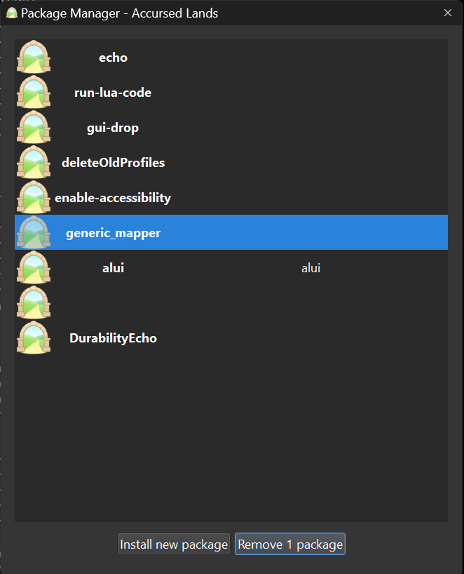

# Getting Started with the Accursed Lands Mudlet UI

The Accursed Lands Mudlet UI is a user interface designed to enhance the gaming experience in the Accursed Lands MUD. This guide will help you get started with the UI, including installation, and usage.

## Installation

The Accursed Lands Mudlet UI should be downloaded from the server when you connect to the game via Mudlet. 

## Configuration

The `generic_mapper` that Mudlet adds by default to all profiles should be removed. 

When your profile is open in Mudlet, either logged on or just logged off, use the `Toolbox` menu to open the `Package Manager` window. 

The Package Manager window will open. Select the `generic_mapper ` package and click the `Remove 1 package` button.

This will remove the generic mapper from your profile and prevent any conflicts from occurring with the mappers that is included with the Accursed Lands Mudlet UI.

## Start Playing

Once you have the Mudlet UI installed and configured, you can start playing the game. The UI provides various features to enhance your gaming experience.
