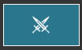
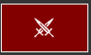
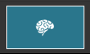

# Menu Bar

The top menu bar has icons to boxes that show your current hunger, thirst, fatigue, posture, mercy, travel, and common sense states. It also has a button to open this Help Site.

## Hunger

## Thirst

## Fatigue

## Posture

## Mercy

Mercy On

Mercy Off

You can turn Mercy on or off by clicking the button.

## Auto Travel

Auto Travel On

Auto Travel Off

You can turn Auto Travel on or off by clicking the button.

## Common Sense

Common Sense On

Common Sense Off

You can turn Common Sense on or off by clicking the button.

## Help

The quesiton mark button opens this site. 

