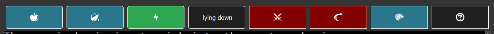
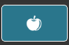
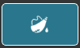
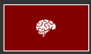

# Menu Bar

The top menu bar has icons to boxes that show your current hunger, thirst, fatigue, posture, mercy, travel, and common sense states. It also has a button to open this Help Site.

## Status

The first four items in the header are status indicators.  Hunger, Thirst, and Fatigue will change from Blue to Green to Yellow to Orange to Red depending on the corresponding current status. we 

### Hunger

#### Stuffed

### Thirst

#### Bloated

### Fatigue

#### Well Rested

#### Somewhat Tired

### Posture

Posture Shows your current posture.  It does not change colors. 

#### Laying Down

## Buttons

These items indicate the current setting in the game and can be changed to the opposite setting by clicking on the button. 

### Mercy

Mercy On

Mercy Off

You can turn Mercy on or off by clicking the button.

### Auto Travel

Auto Travel On

Auto Travel Off

You can turn Auto Travel on or off by clicking the button.

### Common Sense

Common Sense On

Common Sense Off

You can turn Common Sense on or off by clicking the button.

## Help

The question mark button opens this site. 

