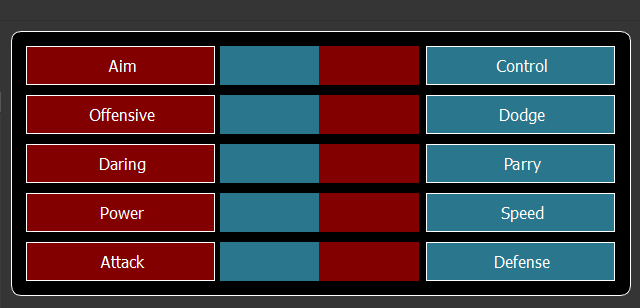
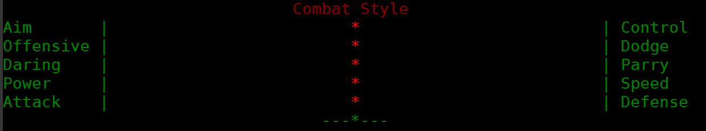
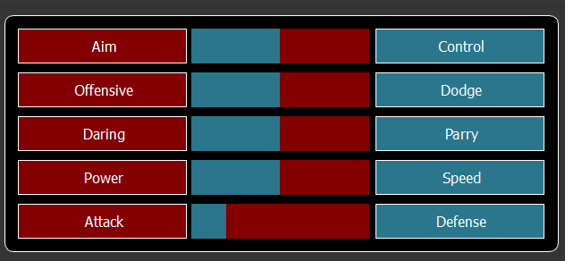
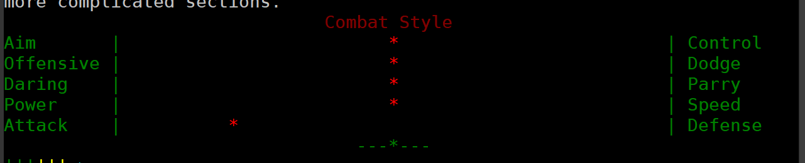
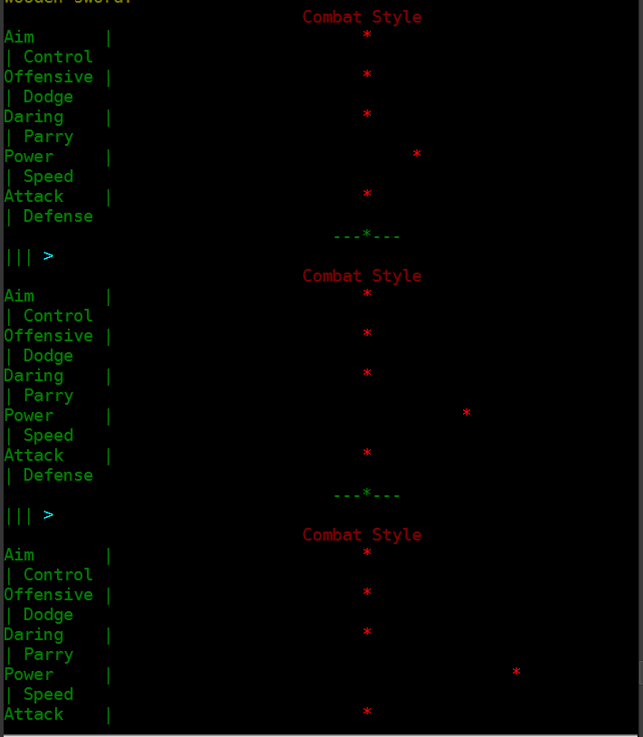
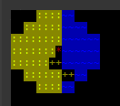
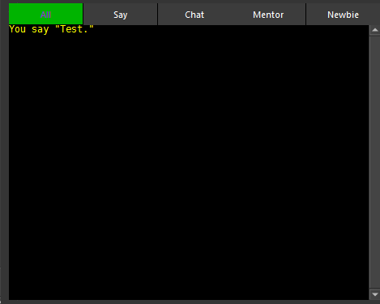

# Right Side Bar

## Styles

The styles bars have been made to mirror the behavior of the Styles in Accursed Lands.

### How to Read the Style Bars

This means that the bar moves towards the style it is related to.

For instance this set of bars matches the following AL Style Bar set.

### Update Your Styles in the GUI

A Style can be increased some by clicking on the name for the style.

The GUI will send commands to Accursed Lands to adjust your styles in the game. 

### Styles not Showing Correct

If your GUI Styles are not reflecting what is in game use the `style` command to refresh them.

## Survey

Survey shows the results of the last survey.  This could be from changing a room or using the survey command.

> If you have turned survey off this will not update when you change rooms.

## Chat

The Chat section Shows chat messages on different tabs for the channel they are from.  

The tabs are: 
All - This is a consolidated chat of all messages.
Say - This tab displays local chat messages
Chat - This tab shows chat from the [Chat] Channel
Mentor - This tab shows chat from the [Mentor] Channel
Newbie - This tab shows chat from the [Newbie] Channel

